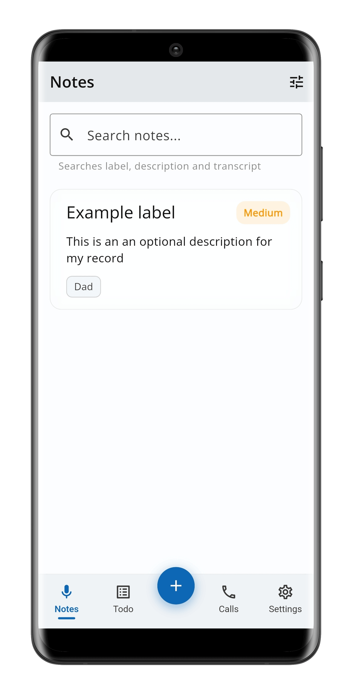
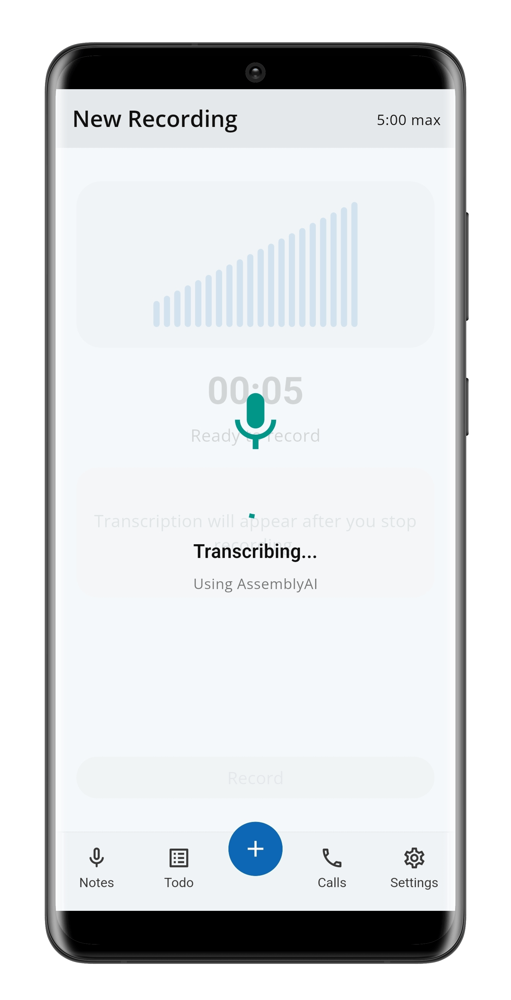
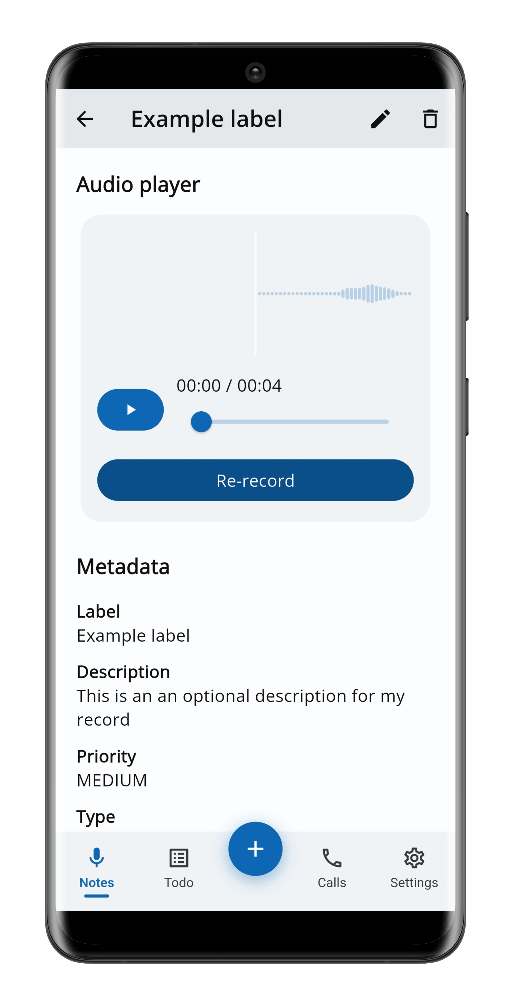
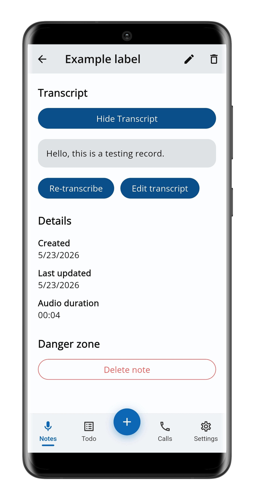
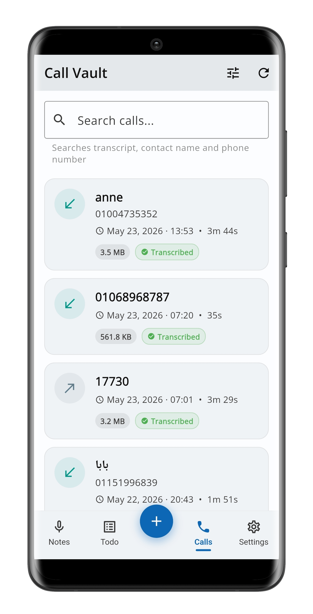
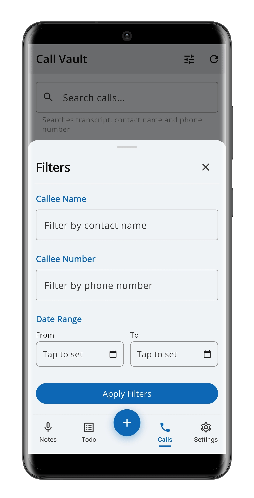
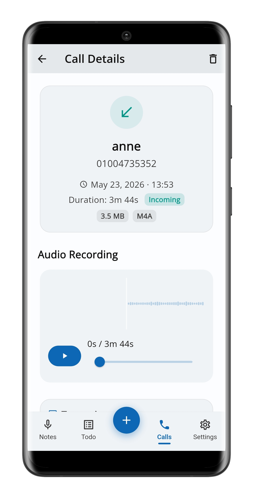
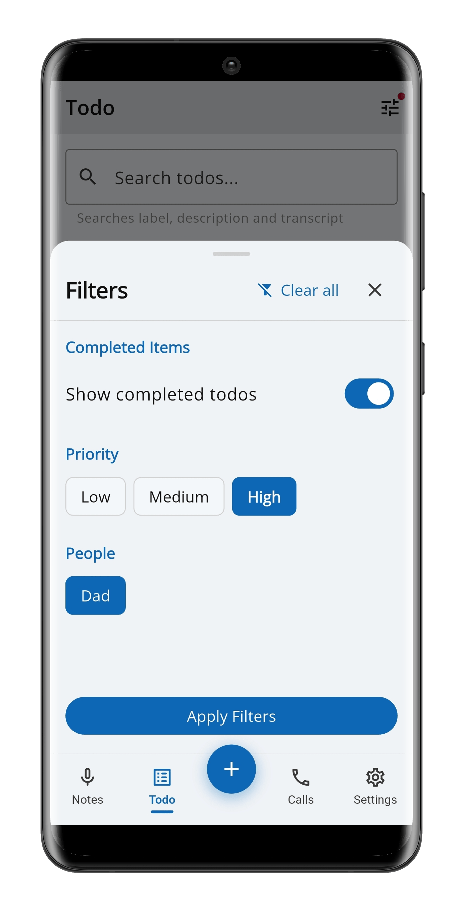
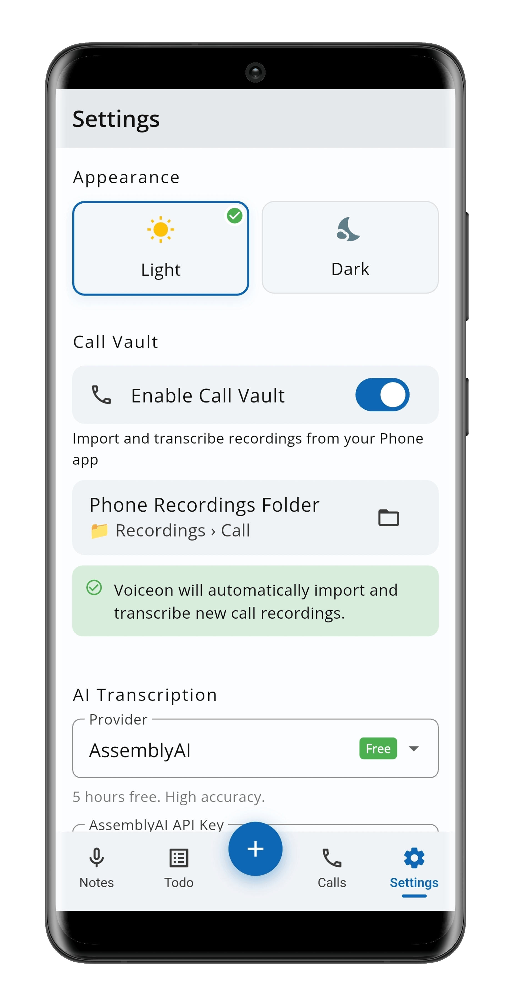
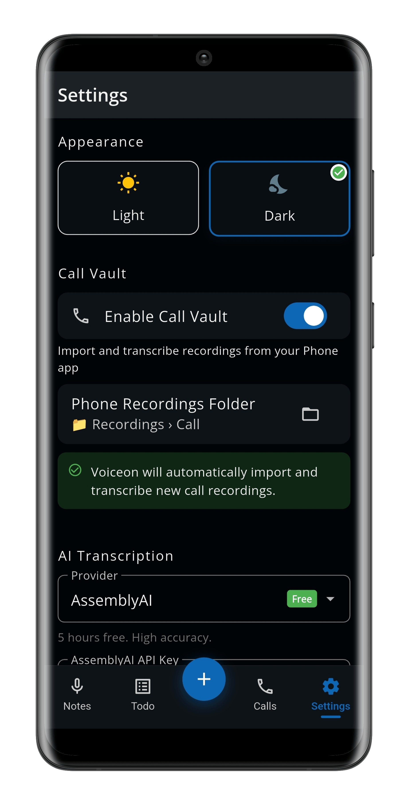

<p align="center">
  
</p>

<h1 align="center">Voiceon</h1>

<p align="center">
  <strong>Voice-first note-taking & call transcription app for Android</strong>
</p>

<p align="center">
  <a href="#features">Features</a> •
  <a href="#screenshots">Screenshots</a> •
  <a href="#getting-started">Getting Started</a> •
  <a href="#architecture">Architecture</a> •
  <a href="#tech-stack">Tech Stack</a> •
  <a href="#contributing">Contributing</a> •
  <a href="#license">License</a>
</p>

<p align="center">
  
  
  
  
  
</p>

---

## What is Voiceon?

Voiceon is an **offline-first, privacy-respecting** mobile app that lets you capture ideas, meeting notes, and tasks using your voice. Just tap record, speak your mind, and Voiceon saves both the audio and an AI-generated transcript — organized, searchable, and always on your device.

Beyond voice notes, Voiceon can also **import and transcribe your phone call recordings**, giving you a searchable archive of conversations with speaker diarization.

**No account required. No cloud sync. Your data stays on your phone.**

---

## Features

### 🎙️ Voice Notes
- **One-tap recording** — Open the app, tap the mic, and start talking. Recordings are saved as AAC/M4A files.
- **AI transcription** — Your recordings are automatically transcribed using your choice of AI provider (see [Supported AI Providers](#supported-ai-providers)).
- **5-minute max** — A built-in timer enforces a 5-minute limit per recording, with a visual warning at 4:30.
- **Background recording** — Recording continues even if you switch apps or the screen turns off.
- **Rich metadata** — Add a title, description, priority level (Low / Medium / High), tagged people, and more to every note.
- **Re-record & re-transcribe** — Not happy with a recording? Replace the audio or re-run transcription from the detail screen.

### ✅ Todo Management
- **Mark notes as todos** — Toggle any note into a todo item with optional due dates.
- **Dedicated Todo tab** — Separate view for all your todos with completion tracking.
- **Swipe to complete** — Quickly toggle completion status with a swipe gesture.
- **Due date warnings** — Cards due within 24 hours pulse with a red glow.

### 📞 Call Vault
- **Import call recordings** — Automatically imports recordings from your phone's built-in call recorder.
- **Speaker diarization** — Identifies and labels different speakers in the conversation (when using WhisperX or supported providers).
- **Contact matching** — Matches recordings to your contacts using the call log.
- **Auto-sync** — New recordings are detected and imported automatically on app launch.

### 🔍 Search & Filter
- **Full-text search** — Search across note titles, descriptions, and transcripts.
- **Filter by priority** — Quickly find high-priority items.
- **Filter by people** — See all notes tagged with a specific person.
- **Smart sorting** — Notes with upcoming due dates appear first, followed by overdue items, then undated notes.

### 🎨 Polished UI
- **Light & dark themes** — Beautiful Material 3 design with a refined blue-teal color palette.
- **Animated waveforms** — Real-time audio visualization during recording.
- **Smooth transitions** — Staggered list animations, animated tab indicators, and polished micro-interactions.
- **Custom typography** — Open Sans for body text, DM Serif Display for display headings.

---

## Supported AI Providers

Voiceon sends audio to an external AI service for transcription. You choose and configure the provider in **Settings → AI Transcription**. All processing happens between your device and the API — no intermediary servers.

| Provider | Free Tier | Notes |
|---|---|---|
| **Groq** | ✅ Free | Fast inference using Whisper large-v3 |
| **OpenAI Whisper** | ❌ Paid (~$0.006/min) | Excellent quality |
| **AssemblyAI** | ✅ 5 hours free | High accuracy |
| **Deepgram Nova-2** | ✅ $200 free credit | Very fast |
| **Rev.ai** | ✅ 5 hours free trial | Good accuracy |
| **Custom WhisperX** | ✅ Self-hosted | Your own server with speaker diarization |

> **Note:** You need to provide your own API key. Voiceon does not include any API keys.

---

## Screenshots

<!-- 
Add your screenshots here. Recommended format:

-->

<p align="center">
  
  
  
  
  
  
  
  
  
  
</p>

---

## Getting Started

### Prerequisites

| Tool | Version | Install |
|---|---|---|
| Flutter SDK | 3.22+ (stable) | [flutter.dev/docs/get-started/install](https://flutter.dev/docs/get-started/install) |
| Dart SDK | 3.11+ | Included with Flutter |
| Android Studio | Latest | [developer.android.com/studio](https://developer.android.com/studio) |
| Android device or emulator | API 24+ (Android 7.0+) | — |

Verify your setup:

```bash
flutter doctor
```

### Installation

1. **Clone the repository**

```bash
git clone https://github.com/x0911/voiceon-flutter.git
cd voiceon-flutter
```

2. **Install dependencies**

```bash
flutter pub get
```

3. **Generate code** (Drift database & Riverpod providers)

```bash
dart run build_runner build --delete-conflicting-outputs
```

4. **Run the app**

```bash
flutter run
```

### Building for Release

To create a release APK:

```bash
flutter build apk --release
```

> **Note:** Release builds require signing configuration. Create a `key.properties` file in the `android/` directory with your keystore details. See the [Flutter deployment docs](https://docs.flutter.dev/deployment/android) for more info.

---

## Architecture

Voiceon follows a **feature-first** project structure with a clean separation of concerns:

```
lib/
├── main.dart                       # App entry point
├── core/                           # Shared app-wide infrastructure
│   ├── database/                   # Drift ORM — tables, DAOs, generated code
│   │   ├── tables/                 # Table definitions (notes, people, calls, ...)
│   │   └── daos/                   # Data Access Objects
│   ├── models/                     # Domain models (NoteModel, CallRecord, ...)
│   ├── repositories/               # Repository layer (abstracts DB access)
│   ├── services/                   # Audio service, sync service, transcription
│   ├── transcription/              # AI provider configs & transcription logic
│   ├── providers/                  # Global Riverpod providers
│   ├── theme/                      # Light/dark theme definitions
│   ├── router/                     # GoRouter navigation config
│   ├── utils/                      # Date formatters, helpers
│   └── widgets/                    # Shared reusable widgets
└── features/                       # Feature modules
    ├── home/                       # Notes list screen
    ├── todo/                       # Todo list screen
    ├── recording/                  # Audio recording screen
    ├── metadata/                   # Note metadata form (post-recording)
    ├── note_detail/                # Note detail/edit screen
    ├── call_vault/                 # Call recordings list & detail
    ├── settings/                   # App settings screen
    └── shell/                      # Bottom navigation shell
```

### Data Flow

```
UI Widget → Riverpod Provider → Repository → Drift DAO → SQLite
                              ↘ AudioService → flutter_sound
                              ↘ TranscriptionService → AI Provider API
```

### Navigation

The app uses a **`StatefulShellRoute`** with `GoRouter` for bottom-tab navigation:

| Tab | Route | Screen |
|---|---|---|
| Notes | `/` | Voice notes list (non-todo only) |
| Todo | `/todo` | Todo items with completion tracking |
| Calls | `/call-vault` | Imported call recordings |
| Settings | `/settings` | Theme, Call Vault, AI provider config |

Additional routes: `/record`, `/metadata`, `/note/:id`, `/call-vault/:id`

### Database Schema

The app uses **Drift** (type-safe SQLite ORM) with 5 tables:

- **`notes`** — Voice notes with label, description, transcript, priority, todo flags, audio path, and timestamps
- **`people`** — Tagged people (unique names)
- **`note_people`** — Junction table linking notes to people (many-to-many)
- **`calls`** — Imported call recordings with contact info, direction, duration, transcription status
- **`call_utterances`** — Speaker-diarized transcript segments for calls

---

## Tech Stack

### Core

| Category | Technology |
|---|---|
| Framework | [Flutter](https://flutter.dev) 3.22+ |
| Language | [Dart](https://dart.dev) 3.11+ |
| State Management | [Riverpod](https://riverpod.dev) (flutter_riverpod + riverpod_annotation) |
| Navigation | [GoRouter](https://pub.dev/packages/go_router) |
| Database | [Drift](https://drift.simonbinder.eu) (SQLite ORM) |
| Audio Recording | [flutter_sound](https://pub.dev/packages/flutter_sound) |
| Audio Waveforms | [audio_waveforms](https://pub.dev/packages/audio_waveforms) |

### UI & Theming

| Category | Technology |
|---|---|
| Theming | [FlexColorScheme](https://pub.dev/packages/flex_color_scheme) (Material 3) |
| Typography | [Google Fonts](https://pub.dev/packages/google_fonts) (Open Sans + DM Serif Display) |
| Animations | [flutter_animate](https://pub.dev/packages/flutter_animate) |

### Utilities

| Category | Technology |
|---|---|
| HTTP | [http](https://pub.dev/packages/http) |
| Permissions | [permission_handler](https://pub.dev/packages/permission_handler) |
| URLs | [url_launcher](https://pub.dev/packages/url_launcher) |
| Preferences | [shared_preferences](https://pub.dev/packages/shared_preferences) |
| UUIDs | [uuid](https://pub.dev/packages/uuid) |
| Date Formatting | [intl](https://pub.dev/packages/intl) |

### Dev Dependencies

| Category | Technology |
|---|---|
| Code Generation | [build_runner](https://pub.dev/packages/build_runner) |
| Drift Codegen | [drift_dev](https://pub.dev/packages/drift_dev) |
| Riverpod Codegen | [riverpod_generator](https://pub.dev/packages/riverpod_generator) |
| Linting | [flutter_lints](https://pub.dev/packages/flutter_lints) |

---

## Permissions

Voiceon requests the following Android permissions:

| Permission | Why |
|---|---|
| `INTERNET` | Send audio to AI transcription APIs |
| `RECORD_AUDIO` | Record voice notes (requested at runtime) |
| `VIBRATE` | Haptic feedback for recording events |
| `READ_CONTACTS` | Match call recordings to contact names (Call Vault) |
| `READ_CALL_LOG` | Match recordings to call log entries (Call Vault) |
| `POST_NOTIFICATIONS` | Android 13+ notification support |

> Microphone permission is requested at runtime with a rationale dialog. Call Vault permissions are only requested if you enable the feature.

---

## Project Commands

```bash
# Install dependencies
flutter pub get

# Generate Drift + Riverpod code (run after any DB or provider changes)
dart run build_runner build --delete-conflicting-outputs

# Watch mode (auto-regenerates on save)
dart run build_runner watch --delete-conflicting-outputs

# Run the app (debug)
flutter run

# Run on a specific device
flutter run -d <device-id>

# Build release APK
flutter build apk --release

# Analyze code
flutter analyze

# Run tests
flutter test

# Clean build artifacts
flutter clean && flutter pub get

# List connected devices
flutter devices
```

---

## Contributing

Contributions are welcome! Here's how to get started:

1. **Fork** the repository
2. **Create a feature branch:** `git checkout -b feature/your-feature-name`
3. **Make your changes** — follow the existing code style and architecture patterns
4. **Run code generation** if you modified Drift tables or Riverpod providers:
   ```bash
   dart run build_runner build --delete-conflicting-outputs
   ```
5. **Test your changes** on a device or emulator
6. **Commit** with a descriptive message: `git commit -m "feat: add your feature description"`
7. **Push** and open a **Pull Request**

### Code Style Guidelines

- Follow the existing **feature-first** folder structure
- Use **Riverpod** for state management (prefer annotation-based providers)
- Use the **Repository pattern** to abstract database access
- Keep widgets focused and composable
- Write descriptive commit messages following [Conventional Commits](https://www.conventionalcommits.org/)

### Ideas for Contribution

- 📱 iOS support
- 🌍 Multi-language UI localization
- 📤 Export notes as PDF or Markdown
- ☁️ Optional cloud backup/sync
- 🏷️ Tags and categories for notes
- 📊 Analytics dashboard (recording stats, word counts)
- 🧪 Widget and integration tests
- 📸 Screenshots and store listing graphics

---

## FAQ

<details>
<summary><strong>Does Voiceon work offline?</strong></summary>

The app itself is fully offline — recording, saving notes, and browsing all work without internet. However, **AI transcription requires an internet connection** to send audio to your configured provider's API.
</details>

<details>
<summary><strong>Is my data sent to any server?</strong></summary>

Only when you transcribe audio. The audio file is sent directly from your device to the AI provider you configured (e.g., Groq, OpenAI). No data passes through any Voiceon server. All notes, metadata, and recordings are stored locally on your device.
</details>

<details>
<summary><strong>Can I use Voiceon without an AI provider?</strong></summary>

Yes! You can record voice notes and manage them without configuring any AI provider. Transcription simply won't be available — you can type notes manually instead.
</details>

<details>
<summary><strong>How does Call Vault work?</strong></summary>

Call Vault imports recordings that your phone's **built-in call recorder** has already saved. Voiceon reads from a folder you select (using Android's Storage Access Framework), copies the files into its private storage, and transcribes them. Voiceon does **not** record calls itself.
</details>

<details>
<summary><strong>Is call recording legal?</strong></summary>

Laws vary by country and jurisdiction. Voiceon displays a legal consent dialog before enabling Call Vault. You are responsible for ensuring compliance with local laws regarding call recording and consent.
</details>

---

## License

This project is open-source and available under the [MIT License](LICENSE).

---

<p align="center">
  Built with ❤️ using <a href="https://flutter.dev">Flutter</a>
</p>
